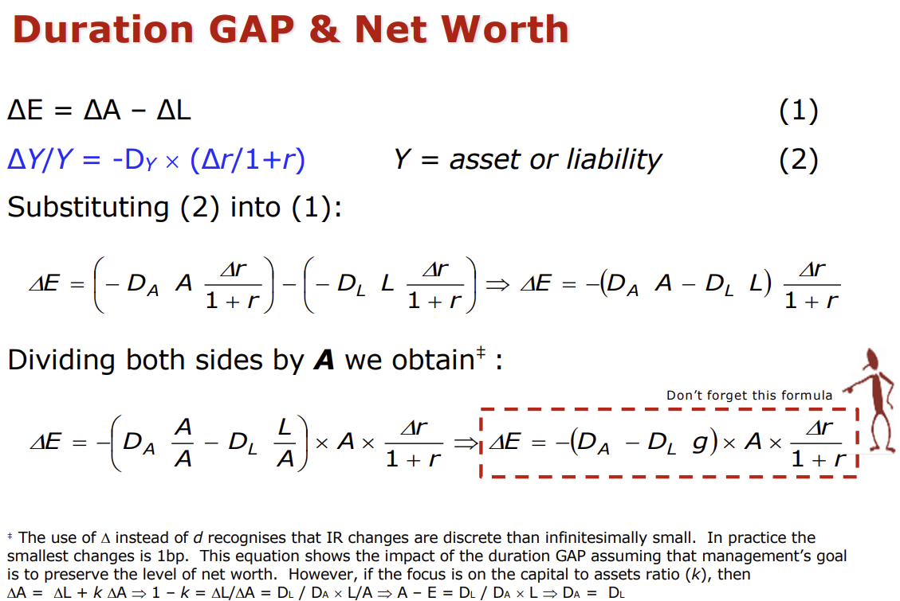
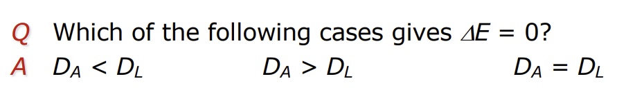

## Balance sheet monitoring

- GAP management
    - monitoring sensitivities and maturities of assets and liabilities
    - liability maturity mix is adjusted in a direction opposite from that of assets
- Sensitivity varies over time and across banks.
    - depends on the planning horizon, which is in turn influenceed by sources of funds.
- banks have several planning periods
    - to understand this we have to quantify the bank's interest rate sensitivity.

Bills are up to 1y notes up to 1 year, bonds, long term securities.

Non earning assets or non interest bearing assets are different terms for cash and cash equivalents.
Read about the savings and loans crisis of 1979 in the US.

## Gap Management: Empirical Issues

- GAP can be managed, but not eliminated
    - GAP close to zero: "stability of return"
- BUT adjusting the GAP risks potential variability in exchange for higher expected return.
- Factors affecting the choice of GAP strategy
    - Risk preference: of managers and owners is often a function of the financial intermediary size.
    - Resources available for restructuring is often a function of the size of the financial intermediary.
    - Not only the direction, but also the degree of uncertainty about future interest rates.

## GAP Management Overview

Pros:

- Quite a useful management tool
- Simple concept and quick exposition of IRR
- Fairly easy to calculate with data availability

Cons:

- What about credit risk?
- Approximate measurement of IRR
- Accounting figures ignoring market values
- What is the potential effect on net worth
- What happens to the assets and liabilities which are not repriced.

Important slide:

This is a bit of a trick question -- we need the duration of the liabilities to be slightly larger than the duration of
your liabilities. Officially: to reduce interest rate risk, financial institutions often aim for liabilities to have
slightly greater duration than assets -- this creates a small negative duration gap that cushions equity against rising
rates. If liabilities mature slightly after assets, institutions are better protected against rising interest rates. In
a rising interest rate environment, asset values drop but if liabilities drop even more, the net effect on equity is
positive. This setup immunizes the institution against rate shocks and helps preserve capital.

Look at the two problem sets in the slides -- especially at the quuestions with the strange font at the bottom.

