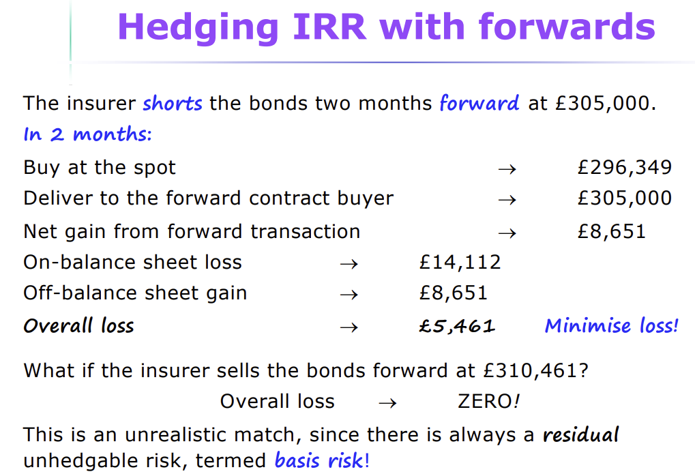
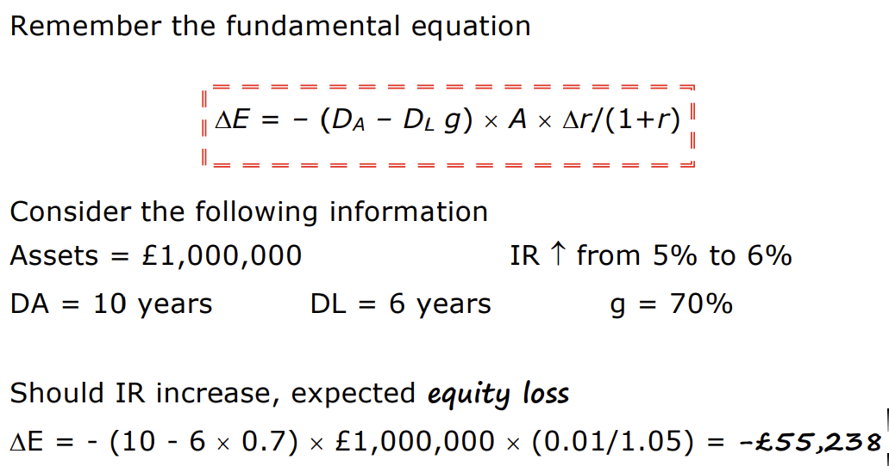

# Bits from the lecture

Basis risk is the risk that the price of the derivative and the price of its underlying asset do not move in perfect
correlation, leading to imperfect hedging. The minimum risk portfolio can't be zero because of basis risk.

The minimum risk portfolio can't be zero because of basis risk that prevents perfect hedging. In the absence of basis
risk a zero position becomes possible.

Hedging interest rates with forwards: offset the on balance sheet loss with the off balance sheet gain or at least
minimize the interest rate exposure.

Remember that an asset is always a long position, whereas a liability is always a short position.

Deep-discount bond is a zero coupon bond. The only duration we will have to calculate is the zero coupon bond duration,
since it is exactly equal to the duration. All other bonds, the duration is always slightly less than the time to
maturity.

The assumption that the bond pays coupons semi-annually is called the Treasury formula. Just multiply the time to
maturity by two and halve the discount rate.

The overall loss you see above, is called basis risk. This is important!

The £305000 is given in the question, this is simply what the dealer is quoting.

Price of the futures contract will be given to us.

If the bond options market expects interest rates to rise, puts will generally lead calls, because if interest rates
rise, prices of bonds fall because of discounting, meaning the value of having the option to sell becomes more valuable.
Puts may lead calls.

Caps are sometimes also called ceilings, it is like a call option, but they are sold OTC and can include multiple strike
prices.

A floor is like the opposite. It is effectively a put with several strike prices .

Look at slide 20 for this week, indicative exam content.

