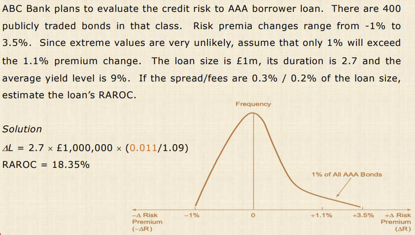
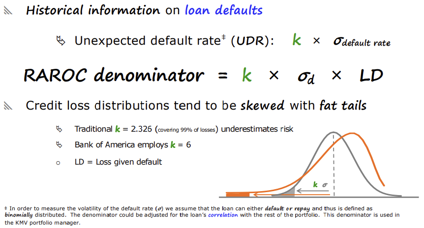

# Credit Risk

## Main Areas

- Credit risk overview
- Financial distress
- Credit risk measurements
    - RAROC, OPT, MRR; EDF, KMV, etc.
- Credit risk management
    - Credit spread forward, stock index futures, put index options, credit spread call option, digital default option,
      etc.
- Credit securitization

## Credit Risk Overview

- Exposure to credit risk
    - the possibility of default on individual loans
    - the possibility of default on loan portfolios
        - loan concentration risk
- Importance of measuring credit risk
    - set credit limits to borrowers
    - valuing fixed income securities
    - estimate credit exposures and potential losses
- Where does credit risk fit in pricing

## Why Should we Care?

- Advances in information technology
- Growth of off balance sheet instruments
- competitive margins and volatile collateral values
- disintermediation
    - banks are left with low credit rated borrowers
- universal banking and originate-and-pretend-to-distribute
- risk-based capital requirements

## Banks and Credit Risk

- Credit quality problems
    - CAPITAL DRAIN
    - net worth reduction
    - growth prospects decline
    - less competence in domestic or international markets
    - insolvency!
- borrowing spreads -- all of these increase the spread
    - higher asset volatility
    - longer debt maturity
    - higher leverage

## Loan Asset Allocation

- Banks spend time on financing and capital budgeting decisions
- What amount to be lent in a certain sector
- what is the allocation within sub-sectors
- is the national benchmark an appropriate one?
    - what about small banks
    - what about niche banks

## Credit Risk Measurement

### Credit Risk Assessment

- Industry's credit attributes, also known as the five C's
    - character, capital, collateral, capital, cycle (economic, corporate)
    - subjective weighting
- Qualitative approach
    - borrower specific factors
        - leverage, collateral, income, reputation, earnings volatility, past information
    - market specific factors
        - business cycle, industry conditions, IR and FX changes, inflation, stock market, international correlations,
          etc.

### Altman's Z Score

Altman's 1968 discriminant function reads as follows
$$Z = 1.2 \times F1 + 1.4 times F2 + 3.3 \times F3 + 0.6 \times F4 + \times F5$$

$$\begin{align}
F1 &= \frac{\text{Working Capital}}{\text{Assets}} \\
F2 &= \frac{\text{Retained Earnings}}{\text{Assets}} \\
F3 &= \frac{\text{Earnings Before Interest and Taxes}}{\text{Assets}} \\
F4 &= \frac{\text{Market Value of Common Stock}}{\text{Book Value of Long-Term Debt}} \\
F5 &= \frac{\text{Sales}}{\text{Total Assets}} \\
\end{align}$$

Original model's boundaries

$$\begin{align}
Z < 1.80 &\rightarrow \space \text{Distress region} \\
1.81 < Z < 2.99 &\rightarrow \space \text{Grey region} \\
Z > 3.00 &\rightarrow \space \text{Safe region} \\
\end{align}$$

#### Other Z Score Models

#### Z Score Graph

#### Bond Ratings & Z Score

### Z Score Summary

- Z Score is essentially descriptive in nature
- Accurate measure of a firm's financial health
- Sector-based combination of ratios
- Embraces key dimensions of corporate solvency
- Z cannot be averaged to provide industry means
- Low Z is only a necessary but not sufficient condition for default
- Z = 2 & 4 implies better performance not twice as strong!
- Z can only raise questions but cannot take decisions.

## Marginal Mortality Rate

MMR is adjusted annually for defaults, sinking fund redemptions and maturities.

$$MRR = \frac{\text{Total value of grade B bonds defaulting in year 1 of issue}}{\text{Total value of grade B bonds outstanding in year 1 of issue}}$$

Problems with MMR: it's a historical measure! So it is sensitive to the period under investigation, the period under
investigation, and the relative size of issues.

### Cumulative Mortality Rate

Survival rate: $SR = 1 - MRR$

CMR is measured over a period t years by subtracting the product of previous years' SR from one
$$CMR = \prod_{i=1}^{t} SR_i$$

### Bankers Trust Risk Adjustment

RAROC relares the loan's income to its risk.

$$RAROC = \frac{\text{Loan income}}{\text{Loan risk}}$$

RAROC = risk adjusted return on capital. Loan income is the sum of loan fees and loan's spread over the cost of funds.
The loan risk is the change in the loan value, i.e. unexpected loss.

Loans' volatility captures all aspects of business risk.

### Loan's Risk Calculation

$$\Delta L = -DL \cdot L \cdot \left( \frac{\Delta r}{1 + r} \right)$$
Where:

- $\Delta L$ = change in loan’s value (loss)
- $DL$ = duration of the loan
- $L$ = loan value
- $\frac{\Delta r}{1 + r}$ = change in the credit risk premium due to credit quality shocks
- $\Delta r = \max\left[\Delta(Y_i - Y_T)\right] > 0$
- $Y_i$ = yield on corporate bonds of credit rating class i
- $Y_T$ = yield on Treasury bonds of matched duration

#### RAROC Example 1

#### RAROC Example 2

### Concentration Limit

Maximum loan to provide given an acceptable loan loss on bank's capital -- management strategy.

$$CL = \left( \frac{\text{max. loss}}{\text{capital}} \right) \cdot \left( \frac{1}{\text{loss rate}} \right)$$

Example: in a particular sector the amount lost is 40 pence per £1 loaned. What is the maximum loan to a single
borrower, if the management wants up to 10% loss on the bank's capital?

Solution
$$CL = 0.1 \times \frac{1}{0.4} = 0.25$$

So 25% of the bank's capital.

### Loan-Volume Approach

Comparison of bank's loans with the national/regional average. LVA resembles standard deviation
$$\sqrt{ \frac{ \sum_{i=1}^{n} \left( l_{ij} - l_j \right)^2 }{n - 1} }$$

Where

- $l_{ij}$ is the proportion of loans across $i$ borrowers by $j$  banks
- $l_i$ is the proportion of the national allocation across $i$ borrowers
- $n$ is the number of borrowers (sectors)

#### LV Approach Example

- A is less volatile than B (at least compared to the national average)
- Proportions derived nationally are most likely to be close to the most efficient composition
    - Concept of diversification
    - Efficient portfolio: min risk + max return

### Loan-Loss Ratio

Make use of historical loan loss ratios
$$L_{\text{Sector}} = a + \beta L_{\text{bank}} + u$$

where

- $L_{\text{Sector}}$ is the sector losses as a percentage of the sector's loans
- $L_{\text{bank}}$ is the bank's losses as a percentage of the bank's total loan portfolio
- $\beta$ is the sector's sensitivity to the bank's total loan portfolio

Think: what does a beta of 0.6 (1.3) indicate and its implications?

Low (high) beta means sector is less (more) sensitive to the bank's total loan portfolio.

Low beta sectors can have higher concentration limits
Low betas are less systematic in a portfolio sense.

