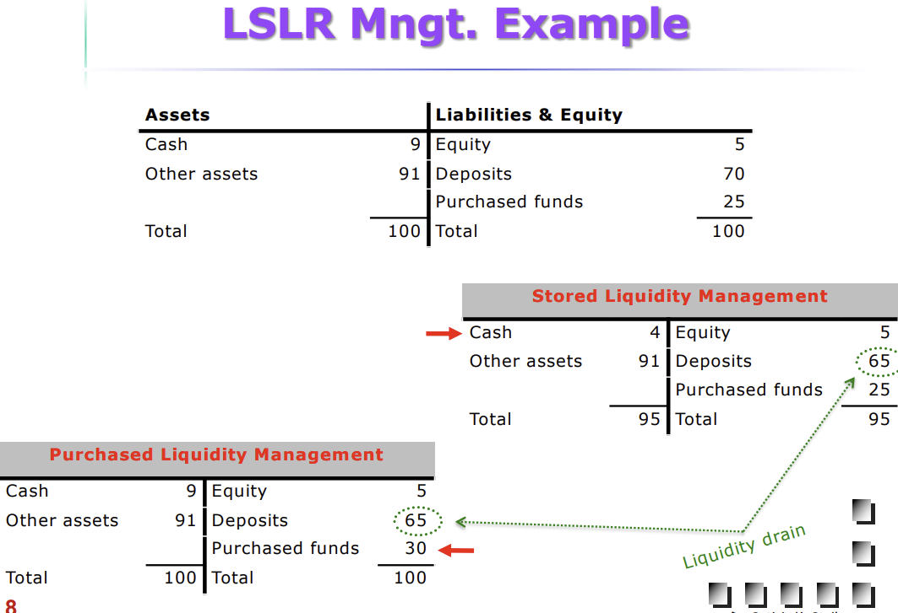
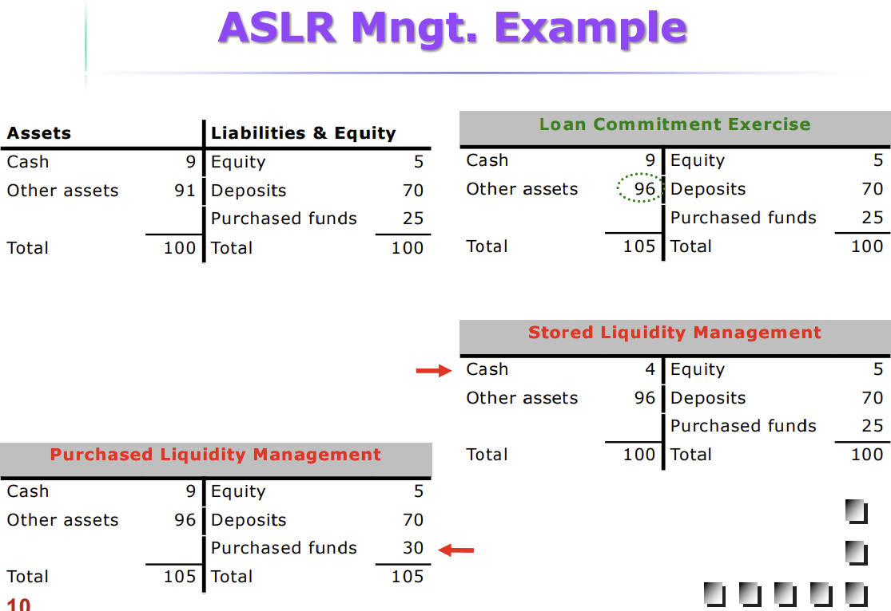
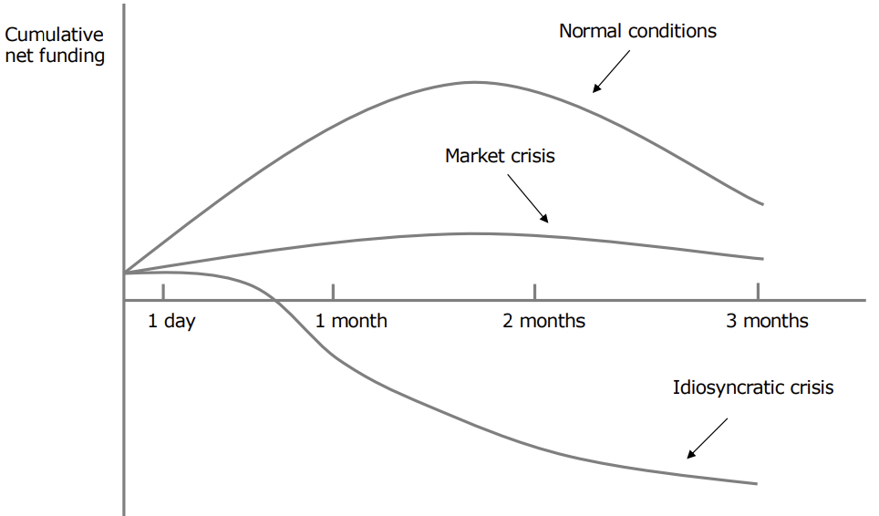

# Liquidity Risk

- Inability ot meet liabilities
    - unexpected deposit withdrawals (banks)
    - unforeseen policyholders' claims (insurers)
    - failure to meet redemption requests
- Dealing with withdrawals
    - assets' fire-sale
    - borrowing additional funds
    - running down cash assets -- liquidity drain
    - if the above don't work and depositors withdraw funds
        - liquidity risk materializes and you get insolvency
    - banks transform short-term funds to long-term investments (maturity transformation function)
        - liquidity risks on both sides of the balance sheet

## Managing Deposit Drains

- Core deposits get transformed to long-term funding sources
- depositary institutions should predict the distribution of net deposit drains
    - net withdrawal patterns and seasonality
- purchased liquidity management
    - access to money markets (liability side - large depositary institutions)

## Liability-Side Liquidity Risk

Stored liquidity management (reserve asset adjustment)

- Adjustment to a deposit drain on the asset side
- Liquid assets
    - US banks hold cash at the Fed
    - UK banks hold cash reserves, circa 1% or more
    - opportunity cost of excess NIBA (non-interest-bearing assets)
    - SLM makes balance sheet shrink (there is no evidence supporting a significant corerlation betweena sset size and
      profitability)

Purchased Liquidity Management

- Adjustment to a deposit drain on the liability side
    - Borrowing, fed funds, repo, CD, etc.
- PLM "insulates assets" from deposit drains
- Regulatory concerns
    - Savers shift to investments (90s)
        - DI unable to attract deposits
    - in the event of a liquidity crunch
        - hard to obtain additional funds
    - potential serious problem with contagion.

## Asset-Side Liquidity Risk

- Risk from loan commitments and other credit lines
    - regulators: LC have grown strikingly
- Risk on bank's investment portfolio
    - market value changes due to IR, credit quality, et.c
    - herding behavior deteriorates asset portfolio
        - equity absorbs the losses

## Measuring Liquidity Exposure

Net liquidity position

- Sources
    - borrowed funds limit
    - cash-type assets and excess cash reserves
- uses
    - borrowed funds already utilized
    - central bank reserve borrowing
- historical figures highlight liquidity patterns

Ratio comparisons (peer grou)

- loan commitments/assets; deposits/assets; borrowed funds/assets; loan/deposits

Liquidity Index

- Potential losses due to fire sales

BIS Maturity Ladder (bin)

- Determining daily and cumulative net funding
    - Cash inflows vs. cash outflows
- DI rely on short-term funding

BIS Scenario Analysis

- Manage liquidity under extreme conditions
    - Market & bank-specific factors

## Crises and Bank Runs

- Bank run: unexpected deposit withdrawals
    - triggered by a panic of market beliefs
        - shortage of funds
        - nonperforming loans
        - risk perception among depositors
    - Information asymmetry about bank's asset value
- Being first in line to withdraw makes a difference
- Consider seasonality and investor preferences
- Understanding bank panic effects
    - Systematic: lose faith in the banking system and engage in a run
    - Contagion: bank failrue raises concerns across FIs
    - Competitive: opposite reaction for other sectors (flight to quality)
- Regulatory routes to reduce likelihood of bank runs
    - Deposit insurance (isn't costless) & Discount window

## Lender of Last Resort

- Depositors feats -> source of market discipline
- the fact that LOLr will provide liquidity
    - enhances depositor's confidence because of the illusion of a government backstop
    - reduces the chance of a bank run
    - banks may assume excessive risks
    - banks may hold less liquidity
- regulators under less pressure (close failing banks promptly)
- potential conflict between LoLR and monetary policy
    - Monetary policy could be affected by extended credit, provided by the LOLR to troubled banks, which in turn
      affects the amount of total reserves outstanding. The Central Bank, however, can offset the extended credit by
      reducing the supply of nonborrowed funds.
- LOLR encourages moral hazard
- LOLR weakens market discipline
- LOLR supports the too big to fail doctrine

## Liquidity Planning
- Key Component in BIS
- Funding decisions to lower funding costs and minimize NEA
- Potential withdrawals' size over various time horizons
- Alternative funding sources (via CB or other FI) for unexpected withdrawals
- Internal borrowing limits with subsidiaries/branches
- Acceptable spread boundaries to pay in each market
- Plan to deal with crises and interact with government agencies
- sequencing of assets' disposal in response to withdrawals' magnitude
- Fund providers in order of most likely to withdraw funds
  - Mutual and pension funds
  - Banks and small corporations
  - Individual depositors

## Extra Notes
### Liquidity
- Endemic to the banking system
  - asset and maturity transformation functions
- Proper asset-liability liquidity strategy
  - Supported by adequate capital/supervision
- Solvent banks' vulnerability -> stress testing
- re-emphasise role of ALCO & LOLR