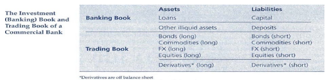
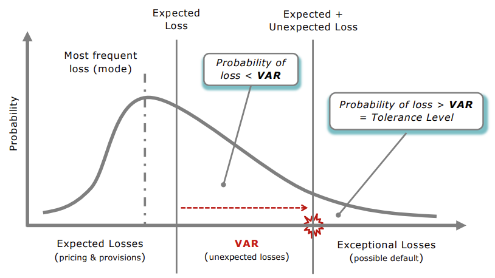

# ALM Week 9: Market Risk Capital

## Main Themes

- Market risk overview
- Value at Risk
- Loss distribution & VaR
- Risk Metrics Approach - DEAR
- BIS versus IMA
- Barings case study

## Market Risk Overview$

- Trading activities -> analyst reports and regulators
- A few well-known risk management disasters
    - 1995 Barings Bank
    - 2007 SocGen
    - 2008 Lehman Brothers
    - 2011 UBS
- Investment and trading portfolios are separate
    - Differences in horizon and liquidity
    - 
    - Market risk: risk arising from changing market conditions

## Why Market Risk

- Capital allocation
- Resource allocation
- Limits establishment
- Performance evaluation
- Management information
- Off-balance sheet information
- Regulator -> risk-based capital requirements
    - expected + unexpected losses

## Value at Risk (VAR)

- VAR is the maximum unexpected loss over some period at a particular tolerance level.
- Tolerance level is the probability that such losses exceed this maximum value.
- VAR is used to define Risk Based Capital (RBC)
    - RBC absorbs losses at a given tolerance level
    - This tolerance level is the FI's default probability
- RBC does not absorb exceptional losses
    - Beyond the upper bound set by the tolerance level

## Issues in Measuring VAR

- VAR embraces three inputs
    - Loss distribution - tolerance level - volatility
- Quality of inputs -> quality of VAR
- What if data are not available
    - Unexpected losses are based on assumptions
    - Assumptions depend upon the nature of risk
    - Nature of risk depends on the nature of the business.
- Fat tails
    - quantification of extreme losses, quantifying what is a hazardous loss
        - small change in tolerance level results in a significant change in the upper bound of losses.
    - extreme losses -> infrequent and unobservable
    - the big challenge -> value extreme losses
- Portfolio Effects
    - diversification
    - VaR is not additive
    - several underlying random parameters
- Asymptotic distributions
    - require specific assumptions
    - skewed distributions: k multiple underestimates losses
    - options have also asymmetric payoffs
- Solutions
    - simulation tools
    - replicate loss distributions

## Default Probabilities

We can use multipliers of loss volatility but they're not linearly related. If k increases, the default or loss rate
decreases less than proportionally.

Choice of k could be subjective, depending on managers' risk aversion, financial intermediary's size, and preferences.

## Questions Addresed by VaR

- Is the capital adequate given the risks
- Are the risks acceptable given the available capital
- How much can the capital cover?
    - Given the risks, the capital determines the default probability
    - Given the capital, the level of risk determines the tolerance level
- Capital and risk should be adjusted until they become compatible/acceptable.

## VaR Summary

Pros

- Quick comparisons
- risk adjusted values
- easily accessible data and simple calculations
- dynamic measure and useful for internal control
- wide range of applications (information reporting, resource allocation, performance evaluation, financial
  institutions, regulators, corporations, asset-management)

Cons

- Reliability of inputs
- asymmetric distributions and fat tails
- portfolio effects and sensitivity of VCOV estimation
- volatility captures all aspects of business risks

## RiskMetrics Approach

- Ultimate objective of market risk modelling
    - Potential loss under adverse circumstances
    - Sir Dennis Weatherstone (JP Morgan Chairman 1980, 4:15 report)
    - DEAR: trading position x price volatility
    - DEAR: daily earnings at risk, it is the daily VaR
        - How is price volatility measured?
        - It depends on the market and the modelling/view as to what a potential adverse move is.
    - DEAR can be converted to any day count convention you need by multiplying by the square root of the period.
    - DEAR is actually encapsulation of position weight and risk (volatility) weight, captured in one measure.
      effectively it is the dollar volatility, not the percentage based volatility.

## FOREX Trading

Sidenote: deep discount bond means a zero coupon bond.

Focus on for exam:

- Lecture 1: do not underestimate it for the revision
  - blend a theoretical question with a problem solving question
  - What is the ALM, why should we coordinate liabilities as assets (coherent approach), risks of financial
    institituions. focus heavily on the lecture notes.
    - specialness of fi
    - what is the alm (from different perspectives)
    - briefly describe the risks of FI
    - integrated financial policy
      - interlinking borrowing and lending
    - the GAP
  - most likely no numeric examples here
- Lecture 2 we should know for ourselves (not for the exam)
  - profitability tables
- Lectures 3 and 4: interest rate and foreign exchange risk
  - check exercise 1, 2, and 3
  - liquidity risk check the two exercises at the back.
- Check ALM review questions
- Concept questions and absolute must
  - check the absolute must questions
  - pay attention to the numerical questions here
- how to analyze a bank using financial ratios.
- The MCQ will include 1 per chapter