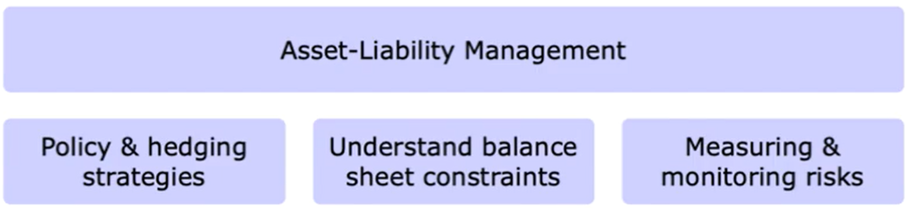

# Asset-Liability Management & Risks of Financial Intermediaries

## Main Areas

- Financial intermediary specialness
- ALM overview
- Management theories
- FI risks
- ALM & IRR
- GAP Analysis

## Specialness of Financial Intermediaries

- Banks play a key role in the financial arena
    - Brokerage function: between households and corporations
    - Asset transformation: deposits to securities investment
    - Maturity intermediation: short-term borrowing to long-term lending
    - Reducing liquidity & price risk: offering deposits and diversifying investments
    - Reducing information costs: monitoring agents (corporates) to act properly
    - Conduits of: monetary policy, credit allocation, payment services
- Don't forget the negative externalities though: economic consequences of problematic or failing banks.

## What is the ALM?

- Risk management of FI
- RMFI embraces a multi-dimensional plan
    - Policy setting
    - Hedging positions
    - Financial decisions
    - Capital budgeting decisions
    - Determining maturity plans
    - Structuring repricing intervals
    - Internal profitability measures

- ALM is also contingency planning!
    - Impact of unexpected changes on FI
        - IR, XR, Competition, Growth, etc.
    - Response to those changes
- Managing the sources and uses of funds in a FI
    - Avoid mismatching of assets and liabilities
    - Protect against liquidity, IR, FX risks, etc.

Note: Through indirect investment (secondary securities for example deposits, insurance policies) FI invest their funds
in stocks, bonds (direct investments). Thus, the FI has transformed a secondary security into a primary security (issue
secondary and buy primary). Primary securities are claims against individuals/corporations (assets of FI) while
secondary securities are claims against FI (liabilities of FI).

- The "maximize profits - minimize risk" *illusion*
    - Basic rule in finance: there is no such thing as a free lunch!
    - If you reduce risk in one dimension, you increase it in another
- ALM is the understanding of those risk-return tradeoffs
- ALM is a multidimensional set of activities.

## ALM Evolution

The discipline of ALM has gone through enormous changes since its inception in the early 70s. During that time, and in
subsequent years, ALM began slowly to bypass the dominance of the accounting percention and cashflow matching and
started instituting the use of advanced analytical techniques, quantitative finance tools as well as sophisticated
pricing formulas and hedging techniques.

## Simplified Management Structure

## Simplified Management Structure

| Chief Risk Officer               | Treasury                       | Chief Financial Officer |
|----------------------------------|--------------------------------|-------------------------|
| **Risk management**              | **Asset–liability management** | **Finance**             |
| Limit framework and setting      | Strategy and planning          | Accounting              |
| Market risk                      | Liquidity risk management      | Budget setting          |
| Credit risk                      | Interest rate risk management  | Forecasting             |
| Operational risk                 | Hedging policy                 | Strategy and planning   |
| Monitoring and control           | Balance sheet management       | Product control         |
| Management information reporting | Internal funds pricing policy  | Valuation and MtM       |
| Compliance monitoring            | Liquidity stress-testing       | Financial reporting     |
| Stress-testing policy            | Capital management             | NIM management          |
| ERM                              | ALCO reporting                 |                         |

## Risk/Return Tradeoff

A core concept is the notion of risk/return tradeoff, which in turn depends on the level of risk aversion, in this case
of a corporation.

Remember that the level fo risk aversion is also determined by exogenous factors such as size, market conditions, etc.

##The Goal of ALM

- Maximize risk adjusted returns over the long run
    - positive correlation between expected profitability and overall risk structure
- Maximize the value of the firm
    - Maximizing shareholder wealth
- Long-run targets
    - A period where growth can be maintained, i.e. sustainable growth
    - Markets do not react favorably if performance cannot be sustained.
- Short-term achievements at the expense of growth and strategic objectives will certainly lead to a precarious slip.

## The ALM Process

- Establishment of policies and guidelines
- Analysis (risks, forecasts, limits, etc.)
- Decision-making
- Execution
- Evaluation

- Financial analysis tells us where we have been
- Capital budgeting tells us where we want to go
- ALM tells us how we are going to get there

## Corporate Management Theories

### Normative Approach

- Classical theory focusing on how managers should act
    - Decisions povide net benefits to owners
        - Owners set the ALM objectives

### Positive Approach

- Givnen the managers' actions, what does it tell us about ALM?
    - In other words, how decisions are made
- Aiming to explain the behaviour of managers arising from the separation of ownership from control, i.e. Agency Theory
- Agency theory examines the relationships between non-owner managers (agents) and owners (principals). The question
  that arises is "should principals monitor agents or not?" Agency costs are the reduction in benefits to owners
  stemming from contracts governing the separation of ownership and control.

## Banking Behavior Theories

Studying the banking literature, one comes across two main schools of thought:

- Hedging hypothesis
    - objective: immunize the bank's baöance sheet against changes in interest rates
- Micro-aspect view
    - objective: maxinization of a utility function -- wealth.

## FI Spread and ALM

- The largest expenses of the FI are interest cost of liabilities
- So measure using Net Interest Income
- ALM is all about controlling the net interest margin
- They can measure also using the net underwriting margin, which takes out policy expenses from premium income.
- Formulas are described in the formula sheet.

Generally, ALM requires:

- Setting risk/return objectives
    - The level of NIM must be compatible
- Knowledge of financial markets
    - Factors affecting IR
    - Impact of IR on NIM
    - FX, Credit, Liquidity, etc.
- Simultaneous decisions about
    - types of assets-liabilities
    - quantity of assets-liabilities
    - mixture of assets-liabilities

## Risks of FI

- Credit risk
- Market risk
- Trading risk
- FX risk
- Liquidity risk
- Sovereign risk
- Interest rate risk
- Off-balance sheet risk
- Technology/operational risk
- Management of these risks is central to the performance of the FI

## Interest Rate Risk

- IRR has three dimensions -- 3D
- Assume financing costs of 7%, Investment return of 8.5%
- Exploit spread by borrowing short-term and lending long-term to earn a 15'bp delta.

## Refinancing Risk

- But what happens in the second year, what if borrowing rate increases to 10%? Suddenly you run a 150bp loss
- This is called refinancing risk, which happens when asssets' maturity is greater than liabilities' maturity, so we are
  said to have a maturity mismatch.
- Refinancing risk is the risk that the cost of rolling over or reborrowing funds will rise above the return on assets.
- During the 80s, a classic example of such a mismatch was the US thrifts (savings banks).

## Reinvestment Risk

- Obviously funds cannot be kept in a safe box
    - New investments take place
    - If the return on assets decreases to 5.5%, when you run a 150bp loss
- Reinvestment risk is when assets' maturity is less than liabilities' maturity.
- In that case, the reinvestment risk is the risk that the return on funds to be reinvested will fall below the
  financing cost.
- During the 80s, a classic example of such exposure was the US banks operating in the Euromarket by borrowing fixed
  while investing in floating rates.

## Market Value Risk

The risk that asset-liability's values will fall/rise with an unexpected increase/decrease in IR
This is generally computed in present value terms.

## Interest Rate Concept

Q: does maturity matching effectively hedge against interest rate risk?
A: not really. Don't forget the concept of duration! A FI funds assets with equity and debt. It's the debt's duration (
in relation to assets) that is important.

- Matching maturities works againyt the active asset transformation function of FI. This may reduce profitability, since
  returns from acting as specialized risk-bearing asset transformer are eliminated.

## Trading Risk

- Assets and liabilities may not be held as long-term investments, funding, or hedging purposes
- FI actively trade their assets and liabilities
    - In the form of loans, mortgages, securitization, bonds, etc.
    - Trading risk is present whenever a FI takes long/short positions in different trades.

## Credit Risk

- FI invest in other corporations
- Government bonds -- no problem
- other borrowers -- possibility of default
- claims held by FI -- interest + principal
- On default FI
    - earns zero interest on asset
    - may lose all or part of the principal
    - access borrower's assets through insolvency procedures.

Actions taken by the FI

- demand risk premia = risk exposure
- close monitoring of their borrowers
- portfolio selection, which has an effect on asset allocation, balancing systematic and idiosyncratic risk

- Systematic credit risk: the risk of default associated with general market wide conditions affecting all borrowers
- Firm-specific credit risk: the risk of default associated with the specific conditions attributed to a single
  borrower.

## Off-Balance Sheet Risk

- Off-balance sheet items -- part of FI global operations
    - they can certainly backfire!
- Letters of credit: guarantee payments of muni bonds
    - if municipality is financially strong, FI gets the fee for issuing LC
    - if municipality defaults, LC becomes an actual liability
- Control over off-balance sheet item
- update information for borrowers
- othr off-balance sheet items include: derivatives, pass-through securities, CMO, etc.

## Technology/Operational Risk

- Prior to 1975: the more paper-based transactions you have, the more your efficiency decreases
- Rapid development of technology during the 80s and 90s
    - e.g. computerized trading
    - advances in IT, rapid access to information
    - Citi: connected to more than 80 countries via satellite
- Objectives of technological expansion
    - increase profits
    - capture new markets
    - reduce operating costs
    - increase efficiency and effectiveness.

- Economies of scale: lower average operational cost by expanding financial services
- economies of scope: cost synergies by using one input and producinhg many outputs, e.g. sell both loan and insurance
  products.

Remember: IT can break down: good example is the internet issues Sotiris experienced with Wifi in his office.

## Forex Risk

- FI invest daily huge amounts in international markets
- FI benefit from FDI and foreign portfolio investment
- US pension funds: 10% of their aseets in foreign securities
- Japanese pension funds: >30% od their assets in foreign securities and 10% in FC deposits.
- IMPORTANT: By matching both size and maturity, the FI is "immunized" against FX and IR risks.

## Sovereign Risk

- Sovereign risk coul dbe a serious form of credit risk
- Foreign corporation may be unable to repay a loan
- Governments may prohibit/limit repayments
- Little recourse to international courts
- Precautions taken:
    - country risk analysis
    - control supply of funds
    - what if a country/currency collapses?? well, shit.

## Liquidity Risk

- Inability to meet liabilities
    - Unexpected cash withdrawals
    - unexpected claims from insurance policyholders
- 3D aspect of liquidity
    - most liquid asset is cash, but try to minimize FI can sell prt of their securities but they may not be easily
      liquidated
    - Fi can sell part of their fixed assets (less liquid)
    - FI can borrow

What if there is no time for negotiating selling or borrowing conditions? It's highly possible that the deal will not be
profitable, resulting in serious liquidity problems or insolvency.

Actions taken

- Good horizon planning
- Strategic asset allocation
- Qualified research analysts
- Emergency procedure actions

## Insolvency Risk

- The result of the aforementioned types of risk
    - inappropriate handling of risks
    - excessive market conditions (exogenous and unavoidable)
- capital adequacy is a key aspect to remain solvent and grow.
- Insolvency risk: inadequate internal capital resources to meet losses.

## Risks' Interdependence

Risks all interdepend on each other. For example, the international Fisher effect (IFE) is an economic theory that
suggests the expected change in the spot exchange rate between two currencies is equal in magnitude and opposite to the
difference in their nominal interest rates.

Same idea holds true for interest rates, if they change then firms will see changes in their credit risk exposures. Same
holds true for FX rates, if FX rates change significantly, then a firm's country risk exposure will change
significantly.

Add on to that, high unemployment is really an accelerator to all of these. Same holds for turbulent financial market
conditions.

## ALM & Interest Rate Exposure

Overview of an integrated financial policy

- NIM reflects ALM decisions
    - the numerator accounts for both yields/costs
- What if financing and investment decisions are separated?
    - Targeted NIM + RONW (Return on net worth, or return on equity) cannot be achieved!
- Institutional risks - asset yields - liability costs
    - this is an important triangle
        - do NOT ignore it
    - aggressive liability strategy leads to investments with acceptable level of risk
        - high cost of funds which can lead to significant credit risk.
- Maturity mismatches can also undermine NIM + RONW
    - US interest rate volatility of 1979-82
- Matching A/L -- avoid liquidity problems
    - assets provide cash to retire liabilities
- Strategies that FI may consider
    - balance sheet restructuring
    - off-balance-sheet hedging
- let's start with balance sheet restructuring

Two ways to evaluate IRR exposure

- IR effect on future cashflows
    - inflows/outflows, NII, earnings, etc.
- IR effect on the market value of equity
    - Duration mismatches affect market values
        - long duration means more exposure

## GAP Analysis

GAP = RSA - RSL

Rate sensitive assets or liabilities are typically repriced at maturity or reset periodically prior to maturity

The GAP is the mismatched amount of assets and liabilities.

Positive GAP is when RSA > RSL, essentially measuring the amount of RSA financed by fixed-rate loans, and a negative GAP
is when RSA < RSL, essentially measuring the amount of fixed rate assets financed by rate sensitive liabilities.

## GAP Ratio

Another way of comparing RSA and RSL is the GAP ratio, which divides rate sensitive assets and rate sensitive
liabilities, which allows cross-sectional analysis between institutions. Tells you, per dollar of rate sensitive
liabilities how much rate sensitive assets does the financial intermediary have.

Most banks typically have a negative GAP.

## Multi-Period GAP
- Evaluation and management of GAP depends on the planning period.
- Difficulties in identifying a single planning  period, then calculate
  - several periodic GAPs
  - A cumulative GAP
- FRA and FRL are considered fixed over the GAP interval

